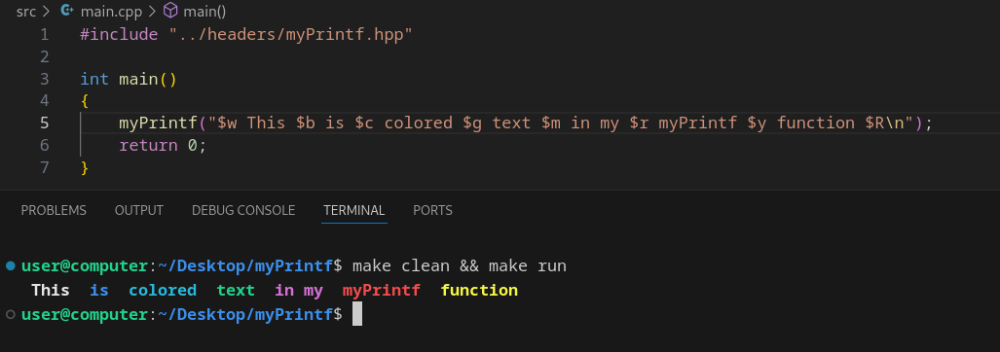
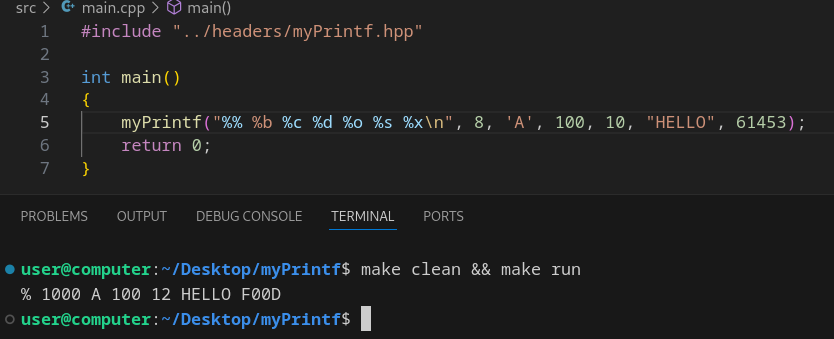

<div align="center">
  
  
  # 🛡️ printf implementation in nasm
  
  
  
</div>

## 🚀 Quick Start
To build the project:
```cpp
git clone https://github.com/BulgakovDmitry/myPrintf
cd myPrintf
make clean && make run
```

## 🔍 Overview
My implementation of the printf function can recognize two types of specifiers: $ and %.
##  '$' specifier
This is my author's specifier for convenient printing of colored text (insert esc sequence)
| specifier        | Result                   |
|------------------|--------------------------|
| `$$`             | Print $                  |
| `$w`             | Beginning of white  text |
| `$b`             | Beginning of blue   text |
| `$c`             | Beginning of cean   text |
| `$g`             | Beginning of green  text |
| `$m`             | Beginning of mang   text |
| `$r`             | Beginning of red    text |
| `$y`             | Beginning of yellow text |
| `$R`             | Complete color printing  |

Example of colored text output:
<div align="center">
  
</div>

##  '%' specifier
This is a standard specifier used in C (С++)
| specifier        | Result                        |
|------------------|-------------------------------|
| `%%`             | Print %                       |
| `%b`             | Printing a binary number      |
| `%c`             | Printing a single character   |
| `%d`             | Printing a decimal number     |
| `%o`             | Printing an octal number      |
| `%s`             | Printing string               |
| `%x`             | Printing a hexadecimal number |

Example of text output using specifiers:
<div align="center">
  
</div>

## 📂 Project Structure
```
myPrintf/
├── headers/            # Header files
│   └── myPrintf.hpp 
├── src/                # Source code
│   ├── myPrintf.s      # myPrintf implementation
│   └── main.cpp        # Usage example
```


## 💡 Usage example:
```cpp
#include "../headers/myPrintf.hpp"

int main() 
{
    myPrintf("$w $$ %% $b %b $c %c $g %d $m %o $r %s $y %x $R\n", 8, 'A', 100, 10, "HELLO", 61453);
    return 0;
} 
```

<div align="center">
  
</div>
